# End User Computing Dashboard Workshop

###  Overview <a id="Overview"></a>

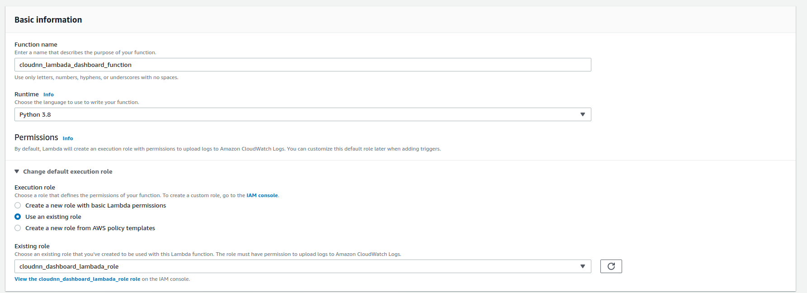

With this tutorial, you can build a dashboard that enables your help desk staff to view details for Amazon AppStream 2.0 fleets and Amazon WorkSpaces directories and instances. For both AppStream 2.0 and WorkSpaces, your staff can also use the dashboard to perform basic administrative tasks. For AppStream 2.0, they can monitor autoscaling activities and manage users’ streaming sessions. For WorkSpaces, they can send the registration code email to a user, or stop, start, restart, and restore a user’s WorkSpace. With this workflow, your teams don’t require access to the AppStream 2.0 console or WorkSpaces console, or cloud-based computing experience.

### Selecting Region and creating S3 Bucket

Lets start - We need to select Region and then create AWS S3 Bucket. You can use Amazon S3 to host static websites without having to configure or manage any web servers. Complete the following steps to create a new Amazon S3 bucket to host all of the static assets for your website. These assets include .html, .css, JavaScript, and image files.


Choose Create Bucket, Give it a name and verify region

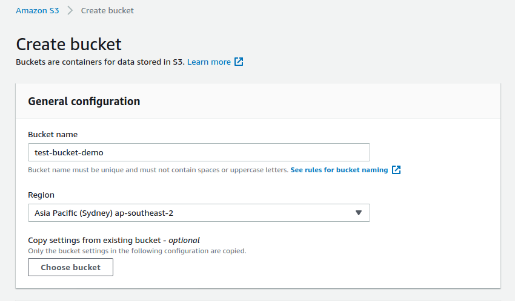

## Create CloudFround Web Distribution

Now we create a Web distibution via CloudFront. Open CloudFront from console then select Create Distribution &gt; unde rWeb &gt; Getstarted. Under domain choose your S3 Bucket, keep value ID default, Yes to restricted bucket access.

1. [ ] Choose **Create Distribution**.

   Under **Web**, choose **Get Started**.

   For **Origin Domain Name**, select your S3 bucket.

   Leave **Origin Path** empty and keep the default value for **Origin ID**.

   For **Restrict Bucket Access**, choose **Yes**.

   For **Origin Access Identity**, choose **Create a New Identity**. Keep the default comment or enter a new one.

   For **Grant Read Permissions on Bucket**, choose **Yes, Update Bucket Policy**.

   Keep the default values for **Origin Connection Attempts** and **Origin Connection Timeout**, and leave **Origin Custom Headers** empty.

   Under **Default Cache Behavior Settings**, for **Viewer Protocol Policy**, choose **Redirect HTTP to HTTPS**.

   Keep the rest of the default settings in this section.

   Under **Distribution Settings**, for **Default Root Object**, enter index.html.

   Keep the rest of the default settings in this section.

   Choose **Create Distribution**.


dmmt6adxe16t4.cloudfront.net

### Creating Amazon Cognito User Pool

Now we build the workflow through Cognito.

* [ ] Amazon Cognito provides authentication, authorization, and user management for your apps. A user pool is a user directory in Amazon Cognito. With a user pool, your users can sign in to your apps through Amazon Cognito.
  1. Open the Amazon Cognito console at [https://console.aws.amazon.com/cognito/](https://console.aws.amazon.com/cognito/).
  2. On the Amazon Cognito welcome page, choose **Manage User Pools**.
  3. In the upper-right corner of the **Your User Pools** page, choose **Create a user pool**.
  4. For **Pool name**, type examplecorp\_dashboard.
  5. Choose **Review defaults**.
  6. On the review page, choose **Create pool**.
  7. Make a note of the **Pool Id** value at the top of the details page. You will need this value in the following modules:

  *     In this module \(Module 2\), Step 4. Add a user and application in AWS SSO, when you specify a value for **Application SAML audience**.

**Pool Id** ap-southeast-2\_dlwHjxtIq

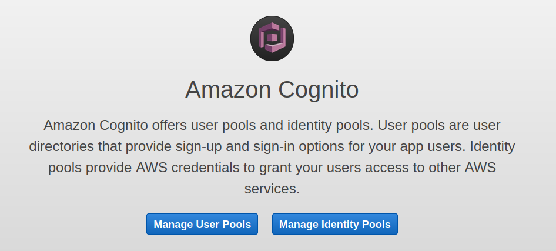

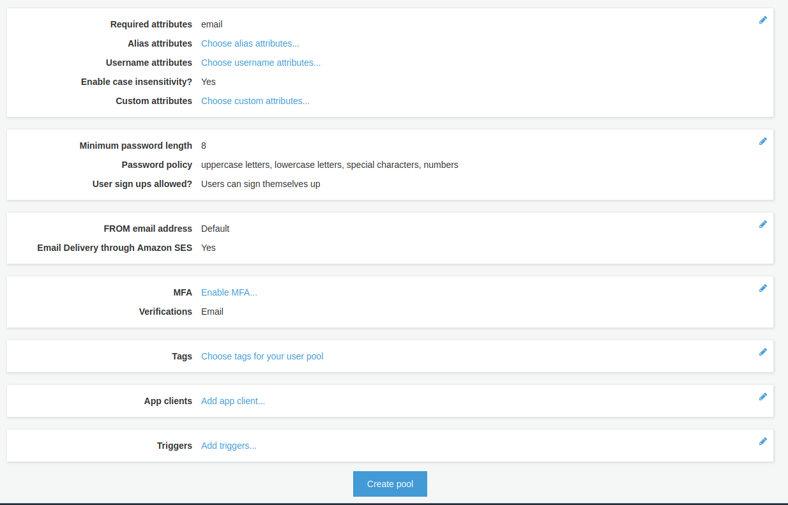

After you create a user pool, create an app client.

### Create an App Client to use Cloudnnn. EUC Dashboard for signing in users

1. In the navigation pane, under **General settings**, choose **App clients**.
2. Choose **Add an app client**.
3. For **App client name**, type examplecorp\_dashboard\_app.
4. Keep the default value for **Refresh token expiration \(days\)**.
5. Clear the **Generate client secret** check box. Client secrets aren't currently supported for use with browser-based applications.
6. Keep the rest of the default settings, and then choose **Create app client**.
7. Make a note of the **App client id** value. You will need this value in Module 5, Step 2. Update the config.js file, when you specify a value for **userPoolClientId**.
8. In the navigation pane, under **General settings**, choose **Policies**.
9. Under **What password strength do you want to require?**, keep the default settings or make changes as required for your environment.
10. Under **Do you want to allow users to sign themselves up?**, choose **Only allow administrators to create users**.
11. Choose **Save Changes**.
12. In the navigation pane, under **App integration**, choose **Domain name**.
13. Enter a unique domain prefix for your user pool \(such as examplecorp\), and then choose **Check availability**.
14. At the top of the page, a message notifies you whether the domain is available. After the domain is verified as available, choose **Save changes**.
15. At the top of the page, make a note of the complete domain name. You will need this value in the following modules:

*     This module \(module 2\), Step 4. Add a user and application in AWS SSO, when you specify a value for **Application ACS URL**.
*     In Module 5, Step 2. Update the config.js file, when you specify a value for **authURL**.

APP client ID28lkltk1298nlr52ufiscerk1s

**.auth.ap-southeast-2.amazoncognito.com**


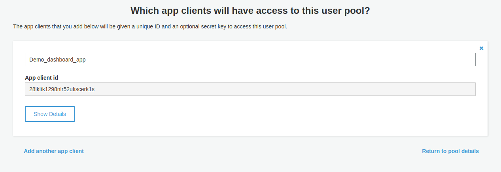

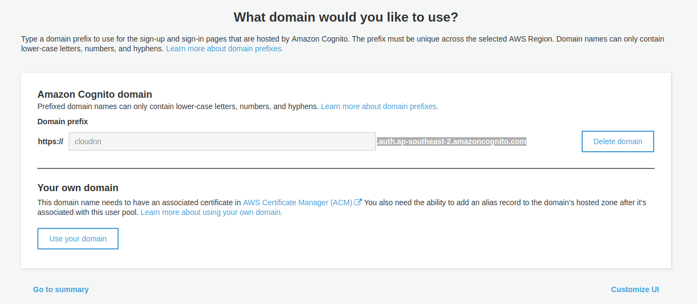

### Enable AWS SSO and create AWS Organisation 

* [ ]   AWS SSO lets you centrally manage SSO access to all of your AWS accounts and cloud applications. AWS SSO also helps you manage access and permissions to commonly used third-party software as a service \(SaaS\) applications, AWS SSO-integrated applications, and custom applications that support Security Assertion Markup Language \(SAML\) 2.0.

  When you open the AWS SSO console for the first time, you’re prompted to enable AWS SSO before you can start managing it.  
  


  1. Open the AWS SSO console at [https://console.aws.amazon.com/singlesignon](https://console.aws.amazon.com/singlesignon). 
  2. On the **AWS Single Sign-on \(SSO\)** page, do one of the following:    •     If this is the first time you’re using AWS SSO, choose **Enable AWS SSO**.    •     If you’ve used AWS SSO before, you can skip this step.


  1. If this is the first time you’re using AWS SSO and you’re not using AWS Organizations, you’re prompted to choose whether to have an AWS organization created for you.
  2. Choose **Create AWS organizatio**n.  With AWS SSO, you manage SSO access and user permissions across all your AWS accounts in AWS Organizations.
  3. After SSO is enabled and an AWS organization is created, the **Welcome to AWS Single-Sign-On** page opens.

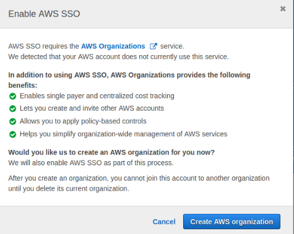

### Add User and Application to AWS SSO

* [ ]   1. To enable users to sign in through a SAML identity provider \(IdP\), you must first update your SAML identity provider and configure your Amazon Cognito user pool. This requires adding Amazon Cognito as a service provider \(SP\) to your SAML IdP. In the navigation pane of the AWS SSO console, choose **Users**, and then choose **Add user**.
  2. Under **User details**, do the following:  •     For **Username**, enter the name that you want to use for sign-in to the user portal. This value can’t be changed later.  •     For **Password**, specify whether to send an email to the user with password setup instructions \(the default option\), or to generate a one-time password that you can share with the user.  •     For **Email address**, enter and then confirm the email address that you want to use.  •     For **First name** and **Last name**, enter the names that you want to use. These values are required for automatic provisioning to work.  •     For **Display name**, keep the default name, which is based on the values that you specified for **First name** and **Last name**, or enter a different name.
  3. Leave the remaining optional fields empty, and then choose **Next: Groups**.
  4. Creating a group is optional. Create a group if you want one for your environment, or skip this step.
  5. Choose **Add user**.
  6. At the top of the page, a message notifies you that the user was added successfully. The user receives an email with the subject **Invitation to join AWS Single Sign-On**. For this tutorial, if you specified yourself as the user, do the following to activate your account:  •     In the email, choose the **Accept invitation** link.  •     The AWS SSO user portal page opens with your user name already populated.  •     Enter a password and confirm it. Make a note of this password. You will need it later in the workshop.  •     Choose **Update user**.  •     The **Single Sign-On** page opens, and a message notifies you that your account is successfully activated.


  1. Return to the AWS SSO console. In the navigation pane, choose **Applications**, and then choose **Add a new application**.
  2. Under **AWS SSO Application Catalog**, choose **Add a custom SAML 2.0 application**.
  3. On the **Configure Custom SAML application** page, for **Display nam**e, enter the following:  examplecorp\_dashboard
  4. Under **AWS SSO metadata**, for **AWS SSO SAML metadata file**, make a note of the URL. You will need the URL in Step 5. Create a Provider in Amazon Cognito, when you specify the **metadata document endpoint URL**.
  5. Skip the **Application properties** section.
  6. Under **Application metadata**, select the link **If you don’t have a metadata file, you can manually type your metadata values**.
  7. For **Application ACS URL**, enter the Amazon Cognito domain name from Step 2. Create an app client to use the Example Corp. website for signing in your users. Append the domain name with the following path:   /saml2/idpresponse   The format is as follows:   https://&lt;domainprefix&gt;.auth.&lt;region-code&gt;.amazoncognito.com/saml2/idpresponse  
  8. For **Application SAML audience**, enter the Amazon Cognito user pool service provider URN. To do so, enter the Amazon Cognito user pool ID that was generated in Step 1. Create an Amazon Cognito user pool. Prepend the user pool ID with the following:   urn:amazon:cognito:sp:   The format is as follows:   urn:amazon:cognito:sp:&lt;user\_pool\_id&gt;  
  9. Choose **Save changes.**
  10. The **examplecorp\_dashboard** app details page opens.
  11. Choose the **Attribute mappings** tab.
  12. For **Maps to this string value or user attribute in AWS SSO**, enter the following value:   ${user:email}  
  13. For **Format**, choose **unspecified**.
  14. Select **Add new attribute mapping** and do the following:   •     For **User attribute in the application**, enter the following value:   http://schemas.xmlsoap.org/ws/2005/05/identity/claims/emailaddress   •     For **Maps to this string value or user attribute in AWS SSO**, enter the following value:   ${user:email}   •     For **Format**, choose **unspecified**.  
  15. Choose **Save changes**.
  16. Choose the **Assigned Users** tab, and choose **Assign users**.
  17. Select the check box next to the name of the user that you created in steps 1 and 2 of this procedure, and then choose **Assign users**.

### 




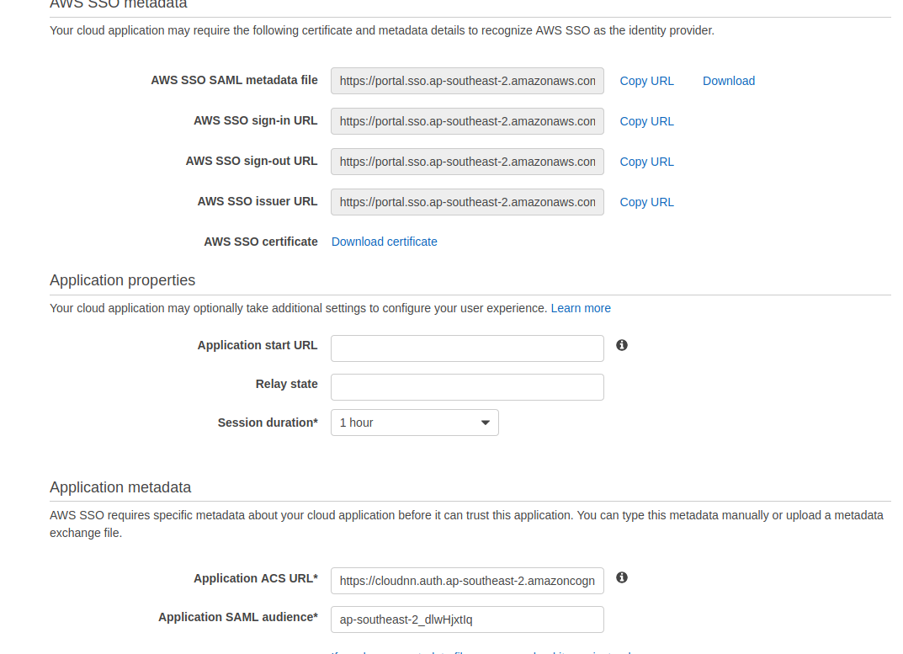

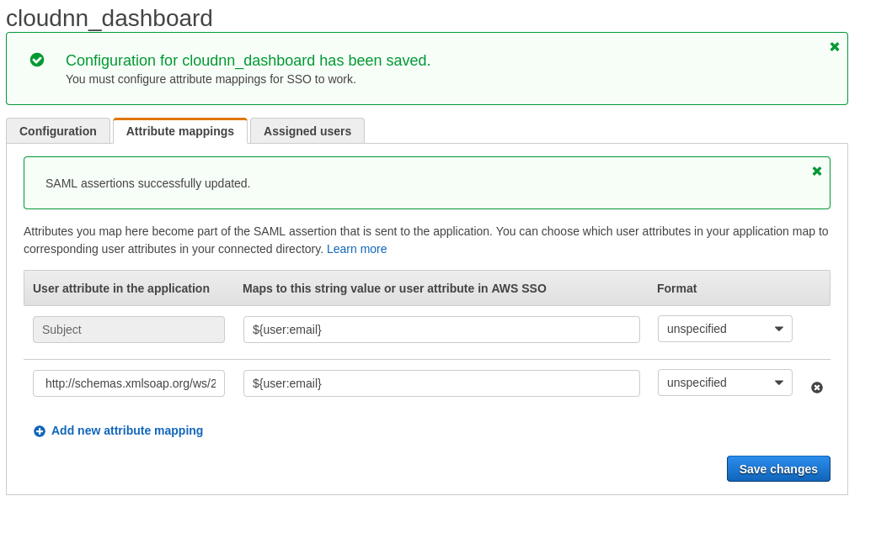

### Create a SAML identity provider in your Amazon Cognito user pool

This procedure describes how to use AWS SSO as the IdP.

1. Open the Amazon Cognito console at [https://console.aws.amazon.com/cognito/](https://console.aws.amazon.com/cognito/). 
2. Choose **Manage User Pools**.
3. On the **Your User Pools** page, choose **examplecorp\_dashboard**.
4. In the navigation pane, under **Federation**, choose **Identity providers**.
5. Choose **SAML** and do the following:  •     Under **Metadata document**, in the box for **Provide metadata document endpoint URL**, enter the **AWS SSO SAML metadata file** URL from Step 4. Add a user and application in AWS SSO. This URL points to the metadata document.  •     For **Provider name**, enter **dashboard**. Make a note of this name. You will need this name in Module 5, Step 2. Update the config.js file.  •     For **Identifiers**, enter the fully qualified domain name \(FQDN\) of the SAML users. This is the part of the user account after the @, but not including the @ symbol.  •     Choose **Create provider**.   After you create the IdP, under **Active SAML Providers**, **dashboard** appears as a provider.  
6. In the navigation pane, under **Federation**, choose **Attribute mapping**.
7. On the **SAML** tab, choose **Add SAML attribute**.
8. For **SAML attribute**, enter the following value: http://schemas.xmlsoap.org/ws/2005/05/identity/claims/emailaddress 
9. For **User pool attribute**, choose **Email**.
10. Choose **Save changes**.
11. In the navigation pane, under **App Integration**, choose **App client settings**.
12. Under **Enabled Identity Providers**, select the **dashboard** check box.
13. For **Callback URL\(s\)**, enter the CloudFront web distribution domain name URL from Module 1, Step 3. Create an Amazon CloudFront web distribution. Enter the URL with and without **index.html** following the domain name in a comma separated list. The format is as follows:   https://&lt;cloudfront\_web\_distribution\_domain\_name&gt;,https://&lt;cloudfront\_web\_distribution\_domain\_name&gt;/index.html  
14. Under **OAuth 2.0**, select the following check boxes: **Implicit grant**, **email**, and **openid**.
15. Choose **Save changes**.

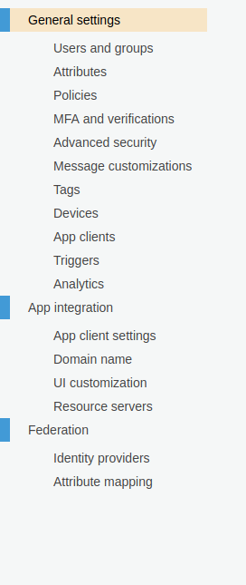


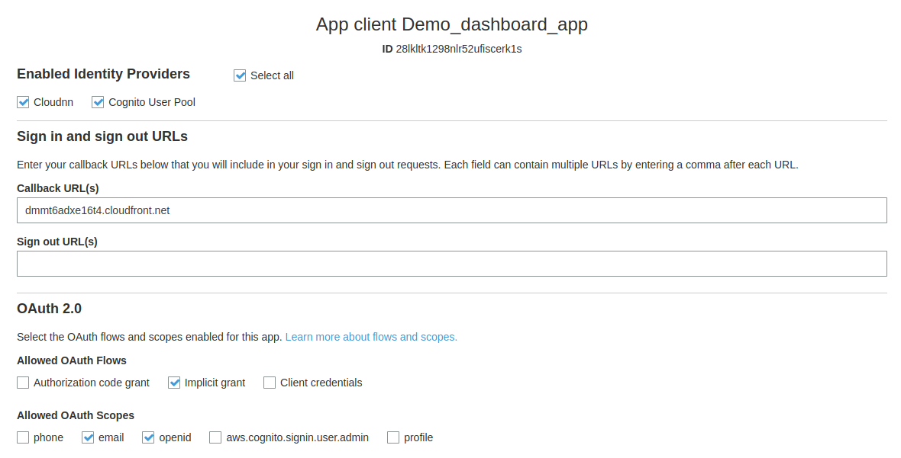

## Creating IAM policy for custom IAM role

* [ ]   To grant permissions to handle backend requests for the End User Computing \(EUC\) dashboard, you create a custom IAM policy that grants the following permissions:  


  •     AWS Application Auto Scaling  
           o DescribeScalingActivities  
   •     AppStream 2.0  
           o DescribeFleets  
           o DescribeImages  
           o DescribeSessions  
           o ExpireSession  
           o ListAssociatedFleets  
           o ListAssociatedStacks  
   •     Amazon CloudWatch Logs  
           o CreateLogGroup  
           o CreateLogStream  
           o PutLogEvents  
   •     Amazon SES  
           o SendEmail  
   •     Amazon S3  
           o DeleteObject  
           o HeadBucket  
           o ListAllMyBuckets  
           o ListBucket  
   •     WorkSpaces  
           o DescribeWorkspaces  
           o DescribeWorkspacesConnectionStatus  
           o DescribeWorkspaceDirectories  
           o RebootWorkspaces  
           o RebuildWorkspaces  
           o StartWorkspaces  
           o StopWorkspaces  
  


  Complete the following steps to create the custom IAM policy:

  1. Open the IAM console at [https://console.aws.amazon.com/iam/](https://console.aws.amazon.com/iam/).
  2. In the navigation pane, choose **Policies**.
  3. If this is your first time choosing **Policies**, the **Welcome to Managed Policies** page appears. Choose **Get Started**.
  4. Choose **Create policy**.
  5. Choose the **JSON** tab.
  6. Copy and paste the following JSON policy into the policy document box.     "Version": "2012-10-17",

```text
    "Statement": [
        {
            "Sid": "VisualEditor0",
            "Effect": "Allow",
            "Action": [
                "application-autoscaling:DescribeScalingActivities",
                "appstream:DescribeFleets",                
                "appstream:DescribeImages",
                "appstream:DescribeSessions",
                "appstream:DescribeStacks",
                "appstream:ExpireSession",                
                "appstream:ListAssociatedFleets",
                "appstream:ListAssociatedStacks",
                "logs:CreateLogGroup",
                "logs:CreateLogStream",                
                "logs:PutLogEvents",
                "ses:SendEmail",
                "s3:DeleteObject",
                "s3:HeadBucket",
                "s3:ListAllMyBuckets",   
                "s3:ListBucket",                                            
                "workspaces:DescribeWorkspaces",
                "workspaces:DescribeWorkspacesConnectionStatus",                 
                "workspaces:DescribeWorkspaceDirectories",
                "workspaces:RebootWorkspaces",     
                "workspaces:RebuildWorkspaces",                 
                "workspaces:StartWorkspaces", 
                "workspaces:StopWorkspaces"                                        
            ],
            "Resource": "*"
        }
    ]
}

```

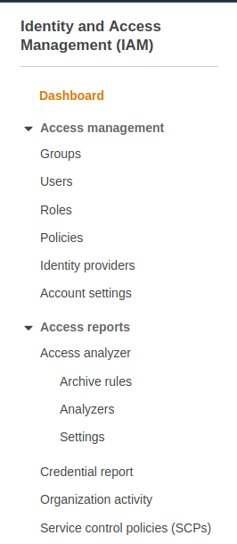


## Create IAM Service Role that lets Lambada functions call AWS service

* [ ]   Lambda requires an IAM service role to allow the service to access resources in other services on your behalf. Complete the following steps to create an IAM service role and attach the policy that you created to this role.  


  1. Open the IAM console at [https://console.aws.amazon.com/iam/](https://console.aws.amazon.com/iam/).
  2. In the navigation pane, under **Roles**, choose **Create role**.
  3. For **Select type of trusted entity**, keep **AWS service** selected.
  4. Under **Choose a use case**, choose **Lambda**, and then choose **Next: Permissions**.
  5. In the **Filter policies** search box, enter examplecorp\_lambda\_dashboard\_policy. When the policy appears in the list, select the check box next to the policy name.
  6. Choose **Next: Tags**. Although you can specify a tag for the policy, a tag isn’t required.
  7. Choose **Next: Review**.
  8. For **Role name**, enter examplecorp\_lambda\_dashboard\_role.
  9. Choose **Create role**.

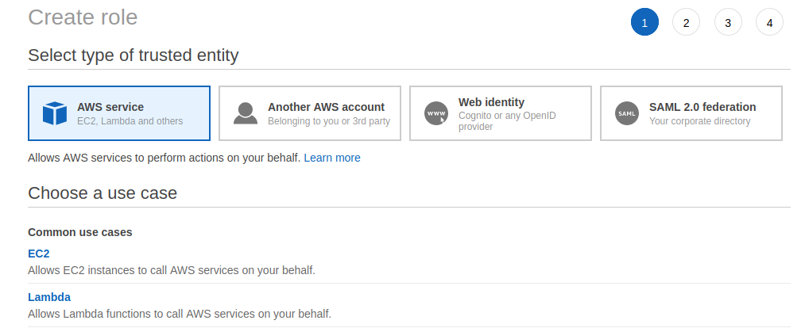

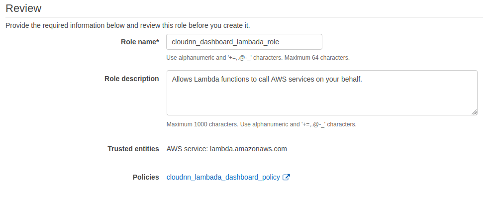

## Create Lambada Function

* [ ]   Complete the following steps to create a Lambda function.

  **Note:** If your AppStream 2.0 fleets and WorkSpaces directories and instances are located in multiple Regions and you want to enable these Regions in the EUC dashboard, repeat these steps to create a Lambda function in each Region that you want to enable.

  1. Download the Example Corp. website assets from [**our repository**](https://d1.awsstatic.com/webteam/getting_started/appstream-2-0/EUCdashboard.b88558255ee7bc71bdaf93fdf975ddfce6573696.zip) to your local computer.
  2. Extract the file that you downloaded on your local computer.
  3. Open the Lambda console at [https://console.aws.amazon.com/lambda/](https://console.aws.amazon.com/lambda/).
  4. Do one of the following:   • If you haven’t created any Lambda functions, a **Getting Started** page displays. Under **Getting Started**, choose **Create a function**.  • If you’ve already created a Lambda function, in the upper-right corner of the **Functions** page, choose **Create a function**.  
  5. On the **Create function** page, keep **Author from scratch** selected.
  6. Under **Basic information**, do the following:   • For **Function name**, enter examplecorp\_lambda\_dashboard\_function.  • For **Runtime**, choose **Python 3.8**.  
  7. Under **Permissions**, choose the arrow icon next to **Choose or create an execution role**. Then do the following:   • For **Execution role**, choose **Use an existing role**.  • For **Existing role**, choose examplecorp\_lambda\_dashboard\_role from the list.  
  8. Choose **Create function**.
  9. Navigate to the location where you extracted files on your local computer in step 2 and open the file **/Lambda/lambda\_function.py** in a text editor. Copy the contents of the file.
  10. In the **Function code** section, on the **lambda\_function** tab, the placeholder code displays. Delete the placeholder code, and then paste the code that you copied in the previous step onto the tab.
  11. In the code, replace &lt;origin-domain&gt; with the CloudFront web distribution domain name URL from Module 1, Step 3. Create an Amazon CloudFront web distribution. The format is as follows:   https://&lt;cloudfront\_web\_distribution\_domain\_name&gt;   This website originates the request to API Gateway.  
  12. In the upper-right corner of the page, choose **Save**, and then close the Lambda console.


## Create a new RESTful API

* [ ] Amazon API Gateway enables you to create, publish, maintain, monitor, and secure your own REST and WebSocket API operations. Complete the following steps to create a new RESTful API.

  1. Open the Amazon API Gateway console at [https://console.aws.amazon.com/apigateway](https://console.aws.amazon.com/apigateway).
  2. Under **Choose an API type**, for **REST API**, choose **Build**.  **Important:** Ensure that you do not select **REST API Private**.
  3. If this is your first API, the **Create your first API** dialog box opens. Choose **OK** to close the dialog box.
  4. Under **Choose the protocol**, keep **REST** selected.
  5. Under **Create new API**, choose **New API**.
  6. Under **Settings**, do the following:  •     For **API name**, enter examplecorp\_dashboard.  •     For **Description**, you can optionally enter a description.  •     For **Endpoint Type**, keep **Regional** selected. 
  7. Choose **Create API**.


## Configure API Gateway for Lambada integration

* [ ]   To configure API Gateway for Lambda integration, complete the following steps.

  1. In the navigation pane of the API Gateway console, under the examplecorp\_dashboard API, choose **Authorizers**.
  2. Choose **Create New Authorizer**, and then do the following:  •     For **Name**, enter examplecorp\_dashboard.  •     For **Type**, choose **Cognito**.  •     For **Cognito User Pool**, select the Amazon Cognito user pool that you created from the list \(examplecorp\_dashboard\). Then, verify that the Region where you created your user pool is selected.  •     For **Token Source**, enter Authorization.  •     Leave **Token Validation** empty.
  3. Choose **Create**.
  4. In the navigation pane, choose **Resources**.
  5. Choose **Actions**, **Create Resource**.
  6. Do the following:  •     Leave the **Configure as proxy resource** check box clear.  •     For **Resource Name**, enter the code for the Region where you created your Lambda function. For example, if you created your Lambda function in US West \(Oregon\), enter:        us-west-2        For a list of AWS Region codes, see the table in [Regional endpoints](https://docs.aws.amazon.com/general/latest/gr/rande.html#regional-endpoints), in the AWS General Reference.  •     For **Resource Path**, verify that the value is /&lt;region-code&gt;.  •     Select the **Enable API Gateway CORS** check box.
  7. Choose **Create Resource**.
  8. With your newly created resource /&lt;region-code&gt; selected in the **Resources** pane, choose **Actions**, **Create Method**.
  9. Under **OPTIONS**, choose **POST**, and then select the check mark to the right of the list to save your changes.
  10. In the **POST Setup** pane, do the following:  •     For **Integration type**, keep **Lambda Function** selected.  •     Select the **Use Lambda Proxy integration** check box.  •     For **Lambda Region**, verify that the Region where you created your Lambda function is selected.  •     For **Lambda Function**, enter the name of the function that you created in module 3: examplecorp\_lambda\_dashboard\_function.  •     Keep the **Use Default Timeout** check box selected.
  11. Choose **Save**.
  12. In the **Add Permission to Lambda Function** dialog box, choose **OK** to confirm your changes.
  13. With your new POST method selected, in the **Method Execution** details pane, choose the **Method Request** card.
  14. In the **POST Method Request** pane, under **Settings**, do the following:  •     Choose the pencil icon to the right of the **Authorization** list.  •     Choose the Amazon Cognito authorizer that you created from the list: examplecorp\_dashboard.  •     Select the check mark to the right of the list to save your changes.  •     Keep the remaining default settings.
  15. In the **Resources** pane, choose the resource root, **/**.   **Note:** If your AppStream 2.0 fleets and WorkSpaces directories and instances are located in multiple AWS Regions and you’re enabling these Regions in the EUC dashboard, verify that you created a Lambda function in each Region that you’re enabling. For more information, see Module 3, Step 3. Create a Lambda function. Then, before continuing, repeat steps 5 through 15 in this procedure for each Region in which you created a Lambda function.  
  16. Choose **Actions**, **Deploy API**.
  17. In the **Deploy API** dialog box, do the following:  •     For **Deployment** stage, choose **\[New Stage\]**.  •     For **Stage name**, enter dashboard.  •     For **Stage description** and **Deployment description**, you can optionally type a description.  •     Choose **Deploy**.
  18. At the top of the dashboard **Stage Editor** pane, the **Invoke URL** displays. Make a note of this URL. You will need this URL in Module 5, Step 2. Update the config.js file, when you specify a value for **InvokeURL**.

## Add and verify a new email address identity in Amazon SES

Amazon SES is an email service that enables you to send and receive email using your own email addresses and domains. Complete the procedure in this section to add and verify an email address identity using the Amazon SES console. You’ll use this email address for testing later on.

If you have a new Amazon SES account, certain restrictions are applied to your account to help prevent fraud and abuse, and to protect your reputation as a sender. All new Amazon SES accounts are placed in the Amazon SES sandbox, and all sender email addresses and domains must be verified.

**Note:** Staying in an Amazon SES sandbox environment is sufficient when you’re in the development and testing phases. However, we recommend that you move your account out of the sandbox if you deploy your solution to production. Doing so lets you send emails without any restrictions to users who request a WorkSpaces registration code reminder email. For more information, see [Moving Out of the Amazon SES Sandbox](https://docs.aws.amazon.com/ses/latest/DeveloperGuide/request-production-access.html) in the Amazon SES Developer Guide.

1. Open the Amazon SES console at [https://console.aws.amazon.com/ses/.](https://console.aws.amazon.com/ses/)
2. In the navigation pane, under **Identity Management**, choose **Email Addresses**.
3. Choose **Verify a New Email Address**.
4. In the **Verify a New Email Address** dialog box, type the email address that you want to add in the **Email Address** box. The email address must be one that you can access.


1. Choose **Verify This Email Address**.
2. In the **Verification Email Sent** confirmation dialog box, review the message, and then choose **Close**.
3. A verification email is sent to the email address that you specified. It may take up to an hour for the email to arrive.
4. The message contains the following subject line: "Amazon Web Services - Email Address Verification Request in region &lt;RegionName&gt;," where RegionName is the name of the AWS Region that is selected in the Amazon SES console.
5. When the verification email arrives, select the verification link in the message.  **Note:** The link in the verification message expires 24 hours after the message is sent. If 24 hours have passed since you received the verification email, repeat steps 1 through 7 to receive another verification email with a valid link.  
6. After you select the verification link, a page displays to confirm that you have successfully verified an email address.
7. You can check the status of your email address identity in the Amazon SES console by doing the following: •     In the navigation pane, choose **Email Addresses**. •     In the list of email address identities, find the email address that you added, and confirm that the verification status for the address is **verified**. 


## Update Config.js file


Complete the following steps to update the **config.js** file in your EUC dashboard website deployment.

1. In Module 3, Step 3. Create a Lambda function, you downloaded and extracted website assets to your local computer. Navigate to the location where you extracted files on your local computer and open the file **/web/assets/js/config.js** in a text editor.
2. In the **config.js** file, replace the following values as indicated: •     &lt;userPoolId&gt; - Enter the Amazon Cognito **Pool Id** from Module 2, Step 1. Create a Cognito user pool. •     &lt;userpool-ClientId&gt; - Enter the Amazon Cognito **App client id** from Module 2, Step 2. Create an app client to use the Example Corp. website for signing in your users. •     &lt;region-code-cognito&gt; - Enter the code for the **AWS Region** in which you configured the Amazon Cognito user pool \(for example, us-west-2\). For a list of AWS Region codes, see the table in [Regional endpoints](https://docs.aws.amazon.com/general/latest/gr/rande.html#regional-endpoints), in the AWS General Reference. •     &lt;authUrl&gt; - Enter the URL for the Amazon Cognito user pool domain from Module 2, Step 2. Create an app client to use the Example Corp. website for signing in your users. •     &lt;idp&gt; - Enter the Amazon Cognito SAML **Provider name** from Module 2, Step 5. Create a SAML identity provider in your Amazon Cognito user pool. This value is case-sensitive. If you used the name specified in the workshop instructions, enter **dashboard**. •     &lt;invokeUrl&gt; - Enter the **Invoke URL** from Module 4, Step 2. Configure API Gateway for Lambda Integration. •     &lt;AppsEnabled&gt; - Enter the names of the services to enable in the dashboard. Use list form. For this workshop, keep the following default values to enable AppStream 2.0 and WorkSpaces - \['AppStream','WorkSpaces'\] •     &lt;loadFirst&gt; - Enter the name of the service tab to open by default when the dashboard starts. By default, AppStream 2.0 is configured to open first. To configure WorkSpaces to open first instead, replace 'AppStream' with 'WorkSpaces' •     &lt;region-code-list&gt; - Enter a comma separated list of codes for one or more AWS Regions that you want to enable in the dashboard. The data for these Regions will be displayed in the EUC dashboard.  For example, if you want to enable us-west-2 only, use the following format: \['us-west-2'\]  If you want to enable us-east-1 and us-west-2, use the following format: \['us-east-1','us-west-2'\]  **Note:** If your AppStream 2.0 fleets and WorkSpaces directories and instances are located in multiple Regions and you’re enabling these Regions in the EUC dashboard, verify that you have configured the following in each Region listed:          o A Lambda function. For more information, see Module 3, Step 3. Create a Lambda function.         o An API Gateway resource and method. For more information, see Module 4, Step 2. Configure API Gateway for Lambda integration.         o An email address that you set up and verified through Amazon SES, as described earlier in this module, in Step 1. Add and verify a new email address identity in Amazon SES.  •     &lt;region-code-default&gt; - Enter the code for the AWS Region that you want to display first in the EUC dashboard. The Region code must also be included in the regions list. •     &lt;noreply@example.com&gt; - Enter the email address that you set up using Amazon SES. Amazon SES sends an email to this address when a EUC dashboard user requests an Amazon WorkSpaces registration code reminder.
3. Save your changes and close the file.

```text
window._config = {
    cognito: {
        userPoolId: '<dlwHjxtIq>', //Enter the Cognito Pool Id from Module 2, Step 1 Create a Cognito user pool.
        userPoolClientId: '<28lkltk1298nlr52ufiscerk1s>', //Enter the Cognito App client id from Module 2, Step 2. Create an app client to use the Example Corp. EUC dashboard website for signing in your users.
        region: '<ap-southeast-2>', //Enter the code for the AWS Region in which you configured the Cognito user pool - for example, us-west-2. For a list of Region codes, see https://docs.aws.amazon.com/en_us/general/latest/gr/aws-service-information.html
        authUrl: '<https://cloudnn.auth.ap-southeast-2.amazoncognito.com>', //Enter the URL for the Cognito user pool domain from Module 2, Step 2. Create an app client to use the Example Corp. EUC dashboard website for signing in your users.
        idp: '<Cloudnn>', //Enter the Cognito SAML provider name from Module 2, Step 5. Create a SAML identity provider in your Amazon Cognito user pool. This value is case-sensitive. If you used the name specified in the workshop instructions, enter dashboard
    },
    api: {
        invokeUrl: '<https://3jtug0m388.execute-api.ap-southeast-2.amazonaws.com/Dashboard>', //Enter the Invoke URL from Module 4, Step 2. Configure API Gateway for Lambda Integration.
    },
    siteOptions: {
        AppsEnabled: ['AppStream','WorkSpaces'], //Enter the names of the services to enable for monitoring in the dashboard. Use list form. For this workshop, keep the following default values to enable AppStream 2.0 and WorkSpaces - ['AppStream','WorkSpaces']
        loadFirst: 'AppStream', //Enter the name of the service tab to open by default when the dashboard starts. By default, AppStream 2.0 is configured to open first. To configure Amazon WorkSpaces to open first instead, replace 'AppStream' with 'WorkSpaces'
        Regions: ['<ap-southeast-2>'], //Enter a comma-separated list of codes for the AWS Regions that you want to enable in the End User Computing (EUC) dashboard. The data for these Regions will be displayed in the dashboard. If your AppStream 2.0 fleets and WorkSpaces directories and instances are located in multiple Regions and you are enabling these Regions in the dashboard, verify that you have configured the following in each Region listed: A Lambda function, an API Gateway resource and method, and an email address set up and verified through Amazon SES.
        defaultRegion: '<region-code-default>', //Enter the code for the default AWS Region that you want to display first in the EUC dashboard. The Region code must also be included in the regions list.
        sendFrom: 'nam.mailbox@gmail.com', //Enter the email address that you set up and verified using Amazon SES. For more information, see Module 5, Step 1. Add and verify a new email address identity in Amazon SES. Amazon SES sends an email to this address when a EUC dashboard user requests an Amazon WorkSpaces registration code reminder.
    }
};

```

### Upload the Cloudnn website assest to your Amazon S3 Bucket

Complete the following steps to upload the Example Corp. website assets by using the Amazon S3 console.

1. Open the Amazon S3 console at [https://console.aws.amazon.com/s3/](https://console.aws.amazon.com/s3/).
2. In the **Bucket name** list, choose the name of the bucket that you created in Module 1, Step 2. Create a new Amazon S3 bucket.
3. In a file explorer window, navigate to the location where you extracted the files, as described in Module 3, Step 3, Create a Lambda function. Navigate to the directory with the **index.html** file and **assets** folder. Select all of the files and folders under that directory.
4. In the Amazon S3 console window, on the **Overview** tab, choose **Upload**.
5. Drag and drop your selections into the **Upload** dialog box.
6. Choose **Upload**.
7. Wait for the upload to complete, and then verify that the correct files and folders appear in the list on the **Overview** tab.


### Sign into your dashboard and view and Appstream and Workspace Data


Before you complete the following steps, make sure that you have already configured an AppStream 2.0 environment that includes at least one fleet. In addition, you must have Amazon WorkSpaces configured with at least one WorkSpace. These configurations are required to generate the data that is displayed in the dashboard.

1. Open a web browser and navigate to https://&lt;cloudfront\_domain\_name&gt;/index.html, where &lt;cloudfront\_domain\_name&gt; is the CloudFront web distribution domain name URL from Module 1, Step 3. Create an Amazon CloudFront web distribution.
2. When prompted, enter the user name and password from Module 2, Step 4. Add a user and application in AWS SSO, and then choose **Sign in**.
3. After you sign in, the page redirects to the EUC dashboard. The dashboard displays details for your AppStream 2.0 fleets and Amazon WorkSpaces directories and instances.
4. For AppStream 2.0, your help desk staff can monitor autoscaling activities and manage users’ streaming sessions. For Amazon WorkSpaces, they can send the registration code email to a user, or stop, start, restart, and restore a user’s WorkSpace. 


entered in the AWS SSO user account that i created


